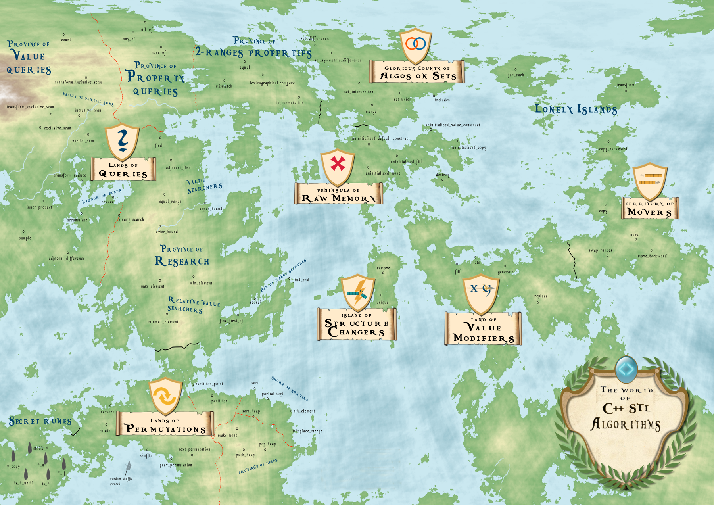

# CPP STL

This repository demonstartes the cpp standard library.

## Heap

- std::make_heap(begin(numbers), end(numbers)) <make a heap into an array>
- std::push_heap(begin(numbers), end(numbers)) <put new element into the array heap>
- std::pop_heap(begin(numbers), end(numbers)) <pop the first element in the array heap>

## Sorting

- std::sort() <sort everything in order>
- std::partial_sort() <sort up to the defined position, anything further is unspecified order>
- std::nth_element() <sort everything smaller than the n element at the left, and everything larger at the left, both sides order is unspecified>
- std::sort_heap <repeated calling pop heap and obtain a sort>
- std::inplace_merge <takes two sorted part of vector and combines them into a sorted vector>

## Partitioning

- std::partition() <baesd on the predicate, and placing all the predicate ones infront and all others behind>
- std::partition_point() <retrieve the partition point in the vector>

## Other Permutation

- std::rotate() <take last element and place at the begining of a vector>
- std::shuffle <shuffle elements order in a vector randomly>
- std::nex_permutation <obtain next permutation of a given vector>
- std::prev_permutation <obtain previous permutation of a given vector>
- std::reverse <reverse the order of a vector>

## Secret Runes

Use along with other std algorithms to generate new algorihms.

### Partitioning-Sort-Heap

### Stable

- std::stable_sort() <it does what the algorithm does but keeps the order>
- std::stable_partition() <it does what the algorithm does but keeps the order>

### Is

- std::is_sorted() <true if sorted>
- std::is_partitioned() <true if is partitioned>
- std::is_heap() <true if is heap>

### Is Util

- std::is_sorted_until() <returns an iterator where the first position where that predicate does not holds true anymore>
- std::is_partitioned_until() <returns an iterator where the first position where that predicate does not holds true anymore>
- std::is_heap_until() <returns an iterator where the first position where that predicate does not holds true anymore>

## Numeric Algorithms

- std::count() <counts how many times an elements appear in a vector>
- std::accumulate/std::reduce/std::transform_reduce() <return sum, and transform reduce can have user implement function>
- std::partial_sum/std::inclusive_scan/std::exclusive_scan/std::transform_inclusive_scan/std::transform_exclusive_scan() <>
- std::inner_product() <product of two vector based on each elements>
- std::adjacent_difference <obtain the adjacent different in a vector>
- std::sample() <takes a number and generate random sample of the vector with size as the given number>

## Querying a Property

- std::all_of() <all elements satisfy the given predicate, returns true if given empty collection>
- std::any_of() <at least one element satisfy the given predicate, return false if given empty collection>
- std::none_of() <none element satisfy the given predicate, return true if given empty collection>

## Querying a Property on 2 Ranges

- std::equal() <compare two vector of same size and element, if just want to make sure they have the same elements, use std::is_permutation() instead, return boolean>
- std::lexicographical_compare() <compare which one is smaller, like {'a', 'b', 'c'}, is smaller than {'a','z'}, return boolean>
- std::mismatch() <compares two vector and stop wherever they differ from each other, return a std::pair<iterator, iterator>>

## Searching a Value

### Not Sorted

- std::find() <takes begin and end and returns an iterator when found>
- std::adjacent_find <takes begin and end and returns the first iterator where the next element is also the same value>

### Sorted

- std::equal_range() <find the range where value is to be search>
- std::lower_bound() <find the first iterator of the range>
- std::upper_bound() <find the iterator where the range ends, not is the match range>
- std::binary_search() <return true if found, but does not tell you where it is in the vector>

- std::search() <serach a sub-range in a given range>
- std::find_end() <looking for a sub-range but starting from the end>
- std::find_first_of() <search any value of the sub-range that first occurs in the given range>

- std::max_element() <return the iterator point to the max value>
- std::min_element() <return the iterator point to the min value>
- std::minmax_element() <return a std::pair of iterators point to the min and max value>

## Algorithms of Sets

- std::set_difference(begin(a), end(a), begin(b), end(b), std::back_inserter(results)) <takes two sets and return the element in the first one but not the second one>
- std::set_intersection(begin(a), end(a), begin(b), end(b), std::back_inserter(results)) <returns the intersected elements>
- std::set_union(begin(a), end(a), begin(b), end(b), std::back_inserter(results)) <returns the union elements in a set>
- std::set_symmetric_difference(begin(a), end(a), begin(b), end(b), std::back_inserter(results)) <return the elements that are in a that are not in b, as well as the elements in b that are not in a>
- std::includes(begin(a), end(a), begin(b), end(b), std::back_inserter(results)) <return true if all elements in b are in a>
- std::merge(begin(a), end(a), begin(b), end(b), std::back_inserter(results)) <merge two sets>

## Movers

- std::copy(first, last, out)
- std::move(first, last, out)
- std::swap_ranges(first, last, out) <both sets have to be the same size... of course>
- std::copy_backwards()
- std::move_backwards()

## Value Modifiers

- std::fill(first last, value) <fill from first to last with given value>
- std::generate(first, last, f()) <call a function f() for each elements>
- std::iota(first, last, value) <fill from first to last but increment the value for each element>
- std::replace(first, last, value1, value2) <replace any value1 with value2 in the range of first to last>

## Changin Structure

- std::remove(begin(collection), end(collection), value) <remove from begin of collection to end if value is found, and shrink the collection accordingly, and it returns an iterator to the position where the collection can be erase, use c.erase(std::remove(begin(c), end(c), value), end(c))>
- std::unique(begin(collection), end(collection), value) <also does the same thing as remove, but it remove adjaction value, and shrink the collection, it will returns an iterator to the position where the collection can be erase, use c.erase(std::unique(begin(c), end(c), value), end(c))>

### Copy

Does same algorithm, but the result is place to a new collection instead of the given one.

- std::remove_copy()
- std::unique_copy()
- std::reverse_copy()
- std::rotate_copy()
- std::replace_copy()
- std::partition_copy()
- std::partial_sort_copy()

## If

- std::find_if()
- std::find_if_not()
- std::count_if()
- std::remove_if()
- std::remove_copy_if()
- std::replace_if()
- std::replace_copy_if()
- std::copy_if()

## Reference

- [video_link](https://www.youtube.com/watch?v=2olsGf6JIkU)
